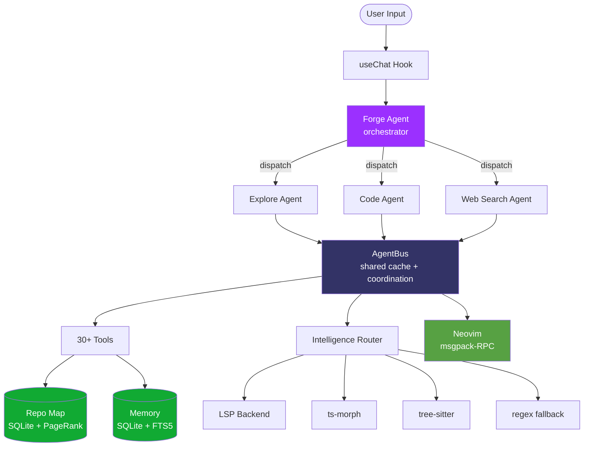
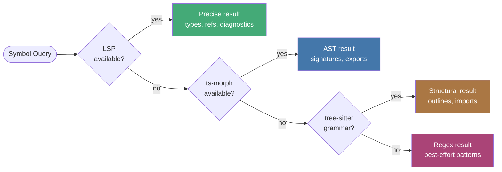
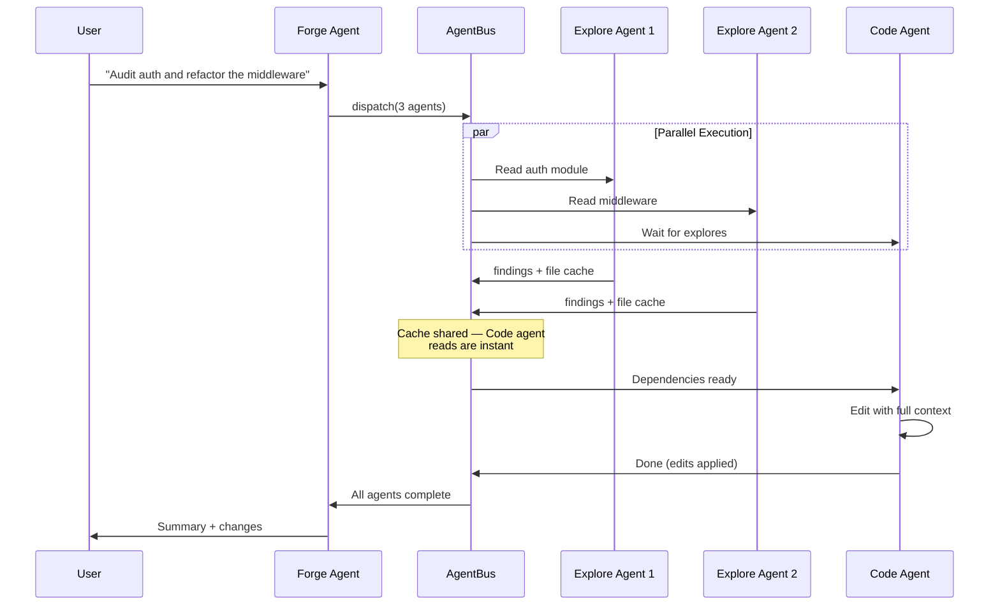
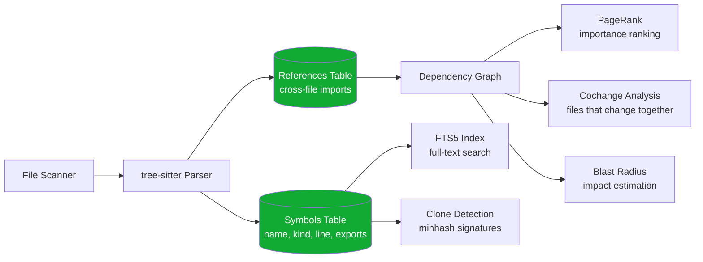
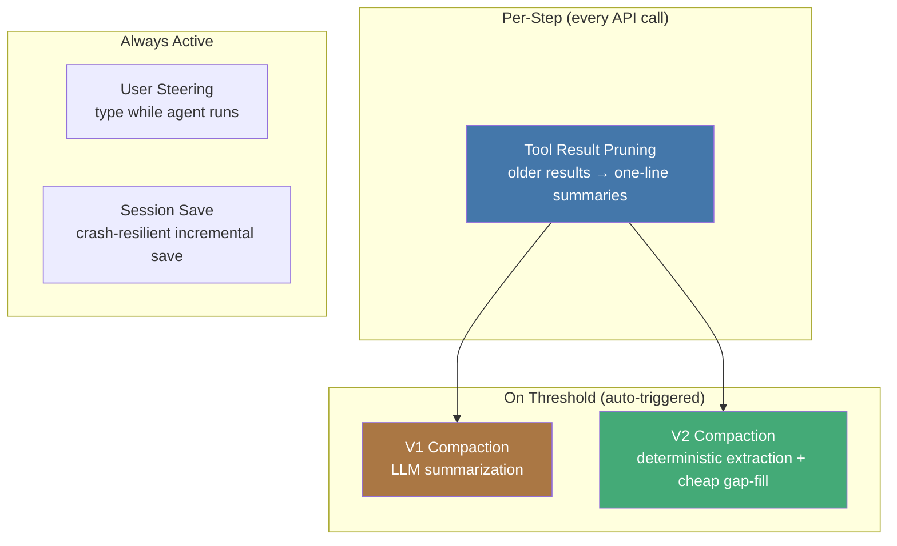

<p align="center">
  
</p>

<h1 align="center">SoulForge</h1>

<p align="center">
  <strong>AI-Powered Terminal IDE</strong><br/>
  Embedded Neovim + Multi-Agent System + Graph-Powered Code Intelligence
</p>

<p align="center">
  <a href="https://www.gnu.org/licenses/agpl-3.0"></a>
  <a href="#"></a>
  <a href="https://www.typescriptlang.org/"></a>
  <a href="#testing"></a>
  <a href="https://bun.sh"></a>
</p>

<p align="center">
  <em>Built by <a href="https://github.com/proxysoul">proxySoul</a></em>
</p>

---

## What is SoulForge?

A terminal IDE where your AI pair programmer lives inside your editor — not beside it. Real Neovim with your config, multi-agent dispatch that parallelizes work, and a code intelligence graph that understands your entire codebase. All in a single terminal session that works over SSH.

```
┌─────────────────────────────────────┐
│  SoulForge                    Tab 1 │
├────────────────┬────────────────────┤
│                │                    │
│   AI Chat      │   Neovim Editor    │
│                │                    │
│  ✓ Analyzing   │   src/app.tsx      │
│  ✓ Editing     │   ~~~~~~~~~~~~~~~  │
│  : thinking... │   ~~~~~~~~~~~~~~~  │
│                │                    │
├────────────────┴────────────────────┤
│  > Type a message...        Ctrl+E  │
└─────────────────────────────────────┘
```

---

## Highlights

<table>
<tr>
<td width="50%">

### Embedded Neovim
Your actual config, plugins, keybindings, and LSP — connected to the AI via msgpack-RPC. The AI reads, navigates, and edits through the same editor you use.

</td>
<td width="50%">

### Multi-Agent Dispatch
Parallelize work across explore, code, and web search agents. Shared file cache prevents redundant reads. Edit coordination prevents conflicts.

</td>
</tr>
<tr>
<td>

### Graph-Powered Repo Map
SQLite-backed codebase graph with PageRank ranking, cochange analysis, blast radius estimation, and clone detection. Zero-token queries — no LLM cost.

</td>
<td>

### 4-Tier Code Intelligence
LSP → ts-morph → tree-sitter → regex fallback chain. Covers 20+ languages. Always has an answer, from precise to approximate.

</td>
</tr>
<tr>
<td>

### Compound Tools
`rename_symbol`, `move_symbol`, `refactor`, `project` do the complete job in one call. Compiler-guaranteed renames. Atomic moves with import updates.

</td>
<td>

### Task Router
Assign models per task type — Opus for planning, Sonnet for coding, Haiku for search. Automatic tier detection routes trivial tasks to fast models.

</td>
</tr>
</table>

---

## Architecture



### Intelligence Fallback Chain



### Multi-Agent Dispatch Flow



---

## Installation

**Requirements:** [Bun](https://bun.sh) >= 1.0, [Neovim](https://neovim.io) >= 0.9

```bash
bun install -g @proxysoul/soulforge
soulforge   # or: sf
```

SoulForge checks for prerequisites on first launch and offers to install Neovim and Nerd Fonts if missing.

> Configure your `.npmrc` for GitHub Packages, or see [GETTING_STARTED.md](GETTING_STARTED.md) for detailed setup.

---

## Usage

### Keyboard Shortcuts

| Key | Action |
|-----|--------|
| `Ctrl+L` | Select LLM model |
| `Ctrl+E` | Toggle editor panel |
| `Ctrl+G` | Git menu |
| `Ctrl+S` | Skills browser |
| `Ctrl+K` | Command picker |
| `Ctrl+N` | New tab |
| `Ctrl+W` | Close tab |
| `Ctrl+X` | Abort current generation |
| `Tab` | Switch tabs |
| `Escape` | Toggle chat/editor focus |

### Slash Commands

| Command | Description |
|---------|-------------|
| `/model` | Switch model |
| `/router` | Per-task model routing |
| `/provider` | Thinking, effort, speed settings |
| `/mode` | Switch forge mode |
| `/git` | Git operations |
| `/compact` | Trigger context compaction |
| `/sessions` | Browse and restore sessions |
| `/setup` | Check and install prerequisites |

### Forge Modes

| Mode | Description |
|------|-------------|
| **default** | Full agent — reads and writes code |
| **architect** | Read-only design and architecture |
| **socratic** | Questions first, then suggestions |
| **challenge** | Adversarial review, finds flaws |
| **plan** | Research → structured plan → execute |

---

## Tool Suite

SoulForge ships 30+ tools organized by capability:

### Code Intelligence

| Tool | What it does |
|------|-------------|
| `read_code` | Extract function/class/type by name (LSP-powered) |
| `navigate` | Definition, references, call hierarchy, implementations |
| `analyze` | File diagnostics, unused symbols, complexity |
| `rename_symbol` | Compiler-guaranteed rename across all files |
| `move_symbol` | Move to another file + update all importers |
| `refactor` | Extract function/variable, organize imports |

### Codebase Analysis (zero LLM cost)

| Tool | What it does |
|------|-------------|
| `soul_grep` | Count-mode ripgrep with repo map intercept |
| `soul_find` | Fuzzy file/symbol search, PageRank-ranked |
| `soul_analyze` | Identifier frequency, unused exports, file profile |
| `soul_impact` | Dependency graph — dependents, cochanges, blast radius |

### Project Management

| Tool | What it does |
|------|-------------|
| `project` | Auto-detected lint, test, build, typecheck, run |
| `project(list)` | Discover monorepo packages with capabilities |
| `dispatch` | Parallel multi-agent execution (up to 8 agents) |
| `git` | Structured git operations with co-author tracking |

<details>
<summary><strong>All tools</strong></summary>

**Read/Write:** `read_file`, `edit_file`, `write_file`, `create_file`, `list_dir`, `glob`, `grep`

**Shell:** `shell` (with pre-commit lint gate, co-author injection, read-command redirect)

**Memory:** `memory_write`, `memory_search`, `memory_list`, `memory_delete`

**Agent:** `dispatch`, `web_search`, `fetch_page`

**Editor:** `editor` (Neovim integration — read, edit, navigate, diagnostics, format)

**Planning:** `plan`, `update_plan_step`, `task_list`, `ask_user`

</details>

---

## LLM Providers

SoulForge supports 9 providers through the Vercel AI SDK:

| Provider | Models | Setup |
|----------|--------|-------|
| **Anthropic** | Claude 4.6 Opus/Sonnet, Haiku 4.5 | `ANTHROPIC_API_KEY` |
| **OpenAI** | GPT-4.5, o3, o4-mini | `OPENAI_API_KEY` |
| **Google** | Gemini 2.5 Pro/Flash | `GOOGLE_GENERATIVE_AI_API_KEY` |
| **xAI** | Grok 3 | `XAI_API_KEY` |
| **Ollama** | Any local model | Auto-detected |
| **OpenRouter** | 200+ models | `OPENROUTER_API_KEY` |
| **LLMGateway** | Custom proxy | `LLMGATEWAY_API_KEY` |
| **Vercel Gateway** | Vercel AI Gateway | `VERCEL_GATEWAY_API_KEY` |
| **Proxy** | Custom endpoint | `PROXY_API_KEY` |

### Task Router

Assign different models to different jobs:

```
┌─────────────────────────────────────┐
│  Task Router                        │
├─────────────────────────────────────┤
│  Planning      claude-sonnet-4-6    │
│  Coding        claude-opus-4-6      │
│  Exploration   claude-opus-4-6      │
│  Trivial       claude-haiku-4-5     │
│  De-sloppify   claude-haiku-4-5     │
│  Web Search    claude-haiku-4-5     │
│  Compact       claude-haiku-4-5     │
└─────────────────────────────────────┘
```

---

## Repo Map

The repo map is a SQLite-backed graph of your entire codebase:



**What it powers:**
- `soul_find` — fuzzy search ranked by PageRank
- `soul_grep` — count mode with repo map intercept (zero-cost for known identifiers)
- `soul_analyze` — unused exports, identifier frequency, file profiles
- `soul_impact` — dependency chains, blast radius, cochange partners
- Dispatch enrichment — auto-injects symbol line ranges into subagent tasks
- AST semantic summaries — docstrings for top 500 exported symbols

See [docs/repo-map.md](docs/repo-map.md) for the full technical reference.

---

## Context Management

SoulForge keeps long conversations productive with layered context management:



- **Tool result pruning** — rolling window keeps last 4 messages full, older results become one-line summaries with symbol enrichment
- **V1 compaction** — full LLM summarization when context exceeds threshold
- **V2 compaction** (opt-in) — deterministic state extraction from tool calls + cheap 2k-token gap-fill
- **User steering** — type messages while the agent is working, injected into next step
- **Pre-commit checks** — auto-runs lint + typecheck before allowing commits

See [docs/compaction.md](docs/compaction.md) for details.

---

## Project Toolchain Detection

The `project` tool auto-detects your toolchain from config files:

| Ecosystem | Lint | Typecheck | Test | Build |
|-----------|------|-----------|------|-------|
| **JS/TS (Bun)** | biome / oxlint / eslint | tsc | bun test | bun run build |
| **JS/TS (Node)** | biome / oxlint / eslint | tsc | npm test | npm run build |
| **Deno** | deno lint | deno check | deno test | — |
| **Rust** | cargo clippy | cargo check | cargo test | cargo build |
| **Go** | golangci-lint / go vet | go build | go test | go build |
| **Python** | ruff / flake8 | pyright / mypy | pytest | — |
| **PHP** | phpstan / psalm | phpstan / psalm | phpunit | — |
| **Ruby** | rubocop | — | rspec / rails test | — |
| **Swift** | swiftlint | swift build | swift test | swift build |
| **Elixir** | credo | dialyzer | mix test | mix compile |
| **Java/Kotlin** | gradle check / checkstyle | javac / kotlinc | gradle test | gradle build |
| **C/C++** | clang-tidy | cmake build | ctest | cmake build |
| **Dart/Flutter** | dart analyze | dart analyze | flutter test | flutter build |
| **Zig** | — | zig build | zig build test | zig build |
| **Haskell** | hlint | stack build | stack test | stack build |
| **Scala** | — | sbt compile | sbt test | sbt compile |

**Monorepo support:** `project(action: "list")` discovers workspace packages (pnpm, npm/yarn workspaces, Cargo workspaces, Go workspaces) with per-package capability detection.

---

## Configuration

Layered config: global (`~/.soulforge/config.json`) + project (`.soulforge/config.json`).

```json
{
  "defaultModel": "anthropic/claude-sonnet-4-6",
  "thinking": { "mode": "adaptive" },
  "repoMap": true,
  "semanticSummaries": "ast",
  "diffStyle": "default",
  "chatStyle": "accent",
  "vimHints": true
}
```

See [GETTING_STARTED.md](GETTING_STARTED.md) for the full reference.

---

## Testing

```bash
bun test              # 1262 tests across 27 files
bun run typecheck     # tsc --noEmit
bun run lint          # biome check (lint + format)
bun run lint:fix      # auto-fix
```

---

## Documentation

| Document | Description |
|----------|-------------|
| [Architecture](docs/architecture.md) | System overview, data flow, component reference |
| [Repo Map](docs/repo-map.md) | Graph structure, PageRank, cochange, clone detection |
| [Agent Bus](docs/agent-bus.md) | Multi-agent coordination, file cache, edit mutex |
| [Compound Tools](docs/compound-tools.md) | rename_symbol, move_symbol, refactor internals |
| [Compaction](docs/compaction.md) | V1/V2 context management strategies |
| [Getting Started](GETTING_STARTED.md) | Installation, configuration, first steps |
| [Contributing](CONTRIBUTING.md) | Dev setup, project structure, PR guidelines |
| [Security](SECURITY.md) | Security policy, responsible disclosure |

---

## License

[AGPL-3.0-only](LICENSE). Third-party licenses in [THIRD_PARTY_LICENSES.md](THIRD_PARTY_LICENSES.md).

<p align="center">
  <sub>Built with care by <a href="https://github.com/proxysoul">proxySoul</a></sub>
</p>
